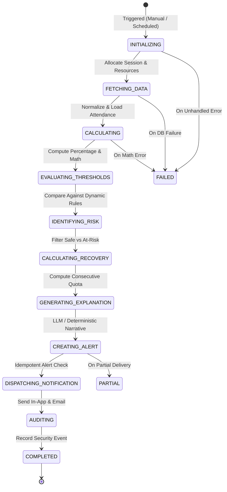

# Autonomous Agent Architecture & State Machine

## 1. Overview

The **Attendance Monitoring Agent** (`app/agents/attendance_agent.py`) is an autonomous, tool-using system designed to scan student attendance data, detect compliance anomalies, calculate mathematical recovery trajectories, generate personalized counseling advice, and dispatch multi-channel alerts.

Unlike basic chatbots or single-turn prompts, the Agent executes via an **auditable 10-stage State Machine** with explicit state transitions, telemetry recording, and alert idempotency.

---

## 2. 10-Stage State Machine Lifecycle



### Stage Definitions
1. **`INITIALIZING`**: Instantiates the run session in the database (`agent_runs`), allocates resources, and sets status to `RUNNING`.
2. **`FETCHING_DATA`**: Fetches all active enrolled students, associated subjects, and session attendance records across the institution.
3. **`CALCULATING`**: Runs deterministic calculations for each student-subject pair (classes attended, classes conducted, current attendance percentage).
4. **`EVALUATING_THRESHOLDS`**: Evaluates attendance numbers against dynamic institutional thresholds (`GREEN`, `YELLOW`, `ORANGE`, `RED`).
5. **`IDENTIFYING_RISK`**: Partitions records into safe students vs students facing shortage or debarment.
6. **`CALCULATING_RECOVERY`**: Computes the exact consecutive future lectures required to recover above statutory minimums (75%) and maximum safe absences.
7. **`GENERATING_EXPLANATION`**: Synthesizes empathetic, factually grounded student explanations and actionable counseling advice using the LLM provider (or deterministic template fallback).
8. **`CREATING_ALERT`**: Enforces **24-hour alert idempotency**. If an active, unresolved alert already exists for the same student and condition, duplicate alert creation is suppressed. Otherwise, creates the persistent alert record.
9. **`DISPATCHING_NOTIFICATION`**: Delivers notifications across configured channels (In-App notification record and SMTP email dispatch with HTML formatting).
10. **`AUDITING`**: Persists an immutable security audit event recording the run ID, duration, students analyzed, anomalies detected, and notifications dispatched.
11. **`COMPLETED`**: Finalizes the agent run with status `COMPLETED`, updates completion timestamp, and records duration.

---

## 3. Controlled Tool Ecosystem

The agent operates strictly through bounded, typed tool functions (`app/tools/attendance_tools.py`). It is denied arbitrary SQL access, shell execution, or filesystem operations.

| Tool Name | Parameters | Output | Purpose |
|---|---|---|---|
| `fetch_student_attendance` | `student_id: int`, `subject_id: Optional[int]` | `List[AttendanceRecord]` | Fetches verified lecture records from database. |
| `calculate_attendance` | `attended: int`, `conducted: int` | `float` | Deterministic percentage calculation. |
| `calculate_required_classes` | `attended: int`, `conducted: int`, `target_pct: float` | `int` | Minimum consecutive classes required to reach target. |
| `calculate_safe_absences` | `attended: int`, `conducted: int`, `target_pct: float` | `int` | Maximum classes student can miss before breaching threshold. |
| `calculate_projected_attendance` | `attended: int`, `conducted: int`, `attend_next: int`, `miss_next: int` | `float` | Simulated attendance percentage. |
| `identify_at_risk_students` | `threshold: float`, `department: Optional[str]` | `List[Dict]` | Queries students falling below specified threshold. |
| `generate_alert` | `student_id: int`, `subject_id: int`, `risk_level: str`, ... | `Alert` | Persists alert in database. |
| `send_notification` | `user_id: int`, `title: str`, `message: str`, `channel: str` | `Notification` | Queues and dispatches in-app and email notices. |
| `create_audit_log` | `user_id: int`, `action: str`, `resource: str`, `details: dict` | `AuditLog` | Writes append-only security log. |

---

## 4. Alert Idempotency & Anti-Spam Architecture

A common failure in automated monitoring systems is duplicate alert flooding. AttendanceAI solves this using **24-hour temporal idempotency**:
```python
# Check if an unresolved alert was generated for this student & subject in the last 24h
twenty_four_hours_ago = datetime.utcnow() - timedelta(hours=24)
existing_alert = self.db.query(Alert).filter(
    Alert.student_id == student.id,
    Alert.subject_id == subject.id,
    Alert.is_resolved == False,
    Alert.created_at >= twenty_four_hours_ago
).first()

if existing_alert:
    # Suppress duplicate alert & notification dispatch
    skipped_duplicates += 1
    continue
```
This guarantees students and faculty are not spammed with duplicate notifications on recurring daily scans.

---

## 5. Automated Background Scheduler

The scheduler (`app/services/scheduler_service.py`) operates as an asynchronous background task within the FastAPI lifespan:
- **Persistence**: Configuration is stored in the `system_settings` database table.
- **Evaluation Loop**: Wakes up every 60 seconds to evaluate if the elapsed time since the last `SCHEDULED` run exceeds `interval_hours`.
- **Concurrency Control**: Enforces mutual exclusion (`_is_executing` lock). If a cycle is in progress, overlapping triggers are safely rejected.
- **Admin Control**: Admins can inspect status, enable/disable the daemon, change interval frequency, and trigger immediate manual cycles via `/api/scheduler/`.
