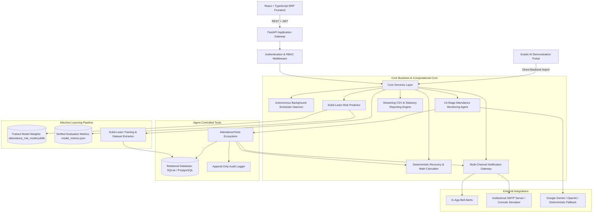

# System Architecture & Technical Specifications

## 1. High-Level Architecture Overview

The **Automated Student Attendance Alert System** is an enterprise-grade university ERP platform engineered to continuously monitor, analyze, predict, and alert academic stakeholders regarding student attendance compliance and debarment risks.

The platform is designed around a **strict separation of responsibilities**:
1. **Deterministic Statutory Engine**: All official attendance percentages, shortfall calculations, consecutive class recovery quotas, and debarment flags are computed with **100% deterministic mathematical precision in Python**. Under no circumstances does an AI model or LLM determine official academic standing.
2. **Predictive Machine Learning Engine**: An empirical Scikit-Learn `RandomForestClassifier` trained on authentic institutional attendance patterns provides **probabilistic trajectory forecasting** and early anomaly warnings.
3. **Conversational & Generative AI**: An LLM integration (supporting Google Gemini, OpenAI, or local deterministic fallback) synthesizes natural-language explanations, contextual counseling, and student advisories based strictly on already-computed facts.
4. **Autonomous Agent State Machine**: A 10-stage auditable state machine orchestrates controlled tool execution, evaluates dynamic thresholds, generates idempotent alerts, and dispatches multi-channel notifications.

---

## 2. Core Subsystems

### 2.1 Web Application & Interface Layer
- **Framework**: React 18 with TypeScript and Vite.
- **Styling**: Tailwind CSS with custom utility classes conforming to a **Light University ERP aesthetic** (Background: `#F7F8FA`, Cards: `#FFFFFF`, Borders: `#E5E7EB`, Typography: `#111827`, Primary Accent: `#2563EB`).
- **Layout**: Collapsible left sidebar with persistent local state, accessible tooltips in collapsed mode, and full responsive mobile drawer overlays.
- **Portals**:
  - **Student Portal**: Term attendance dashboard, subject breakdown, What-If simulator, historical session log with pagination and CSV export, AI attendance counselor, and alert center.
  - **Faculty Portal**: Assigned subjects dashboard, attendance marking, audit-trail corrections, bulk CSV attendance importer, student rosters, and course CSV exports.
  - **Admin Portal**: Institutional analytics, user and role management, course subjects, dynamic threshold configuration, statutory reporting center, multi-channel notification gateway, autonomous scheduler daemon controls, machine learning telemetry, and audit logs.

### 2.2 Application Gateway & API Layer
- **Framework**: FastAPI (Python 3.12+).
- **Authentication**: JWT Bearer tokens with HS256 signatures, 24-hour expiration, and bcrypt password hashing.
- **Authorization (RBAC)**: Role-based dependency injection enforcing strict boundary checks across `student`, `faculty`, and `admin` roles.
- **Error Handling**: Centralized exception handlers intercepting `HTTPException`, `RequestValidationError`, `SQLAlchemyError`, and generic exceptions, ensuring raw stack traces and internal database schemas are never leaked to clients.

### 2.3 Relational Database Architecture
- **ORM**: SQLAlchemy 2.0 with Alembic database migrations.
- **Engines**: SQLite (default local development) and PostgreSQL (production Docker container).
- **Entities**:
  - `User`: System credentials, role, status, timestamps.
  - `Student`: Roll number, department, semester, user relationship.
  - `Faculty`: Employee ID, department, designation, user relationship.
  - `Subject`: Course code, name, department, semester, total scheduled classes.
  - `Enrollment`: Many-to-many relationship linking students to subjects.
  - `Attendance`: Session records (`PRESENT` / `ABSENT`), session date, notes.
  - `AttendanceCorrection`: Audit log of faculty edits to attendance records.
  - `AttendanceThreshold`: Configurable institution-wide warning thresholds.
  - `Alert`: Triggered attendance deficits, recovery targets, resolution status.
  - `Notification`: In-app and email alert delivery records with retry counts.
  - `AgentRun`: Autonomous monitoring cycles, execution timestamps, duration, stages, and tool execution counts.
  - `AgentLog`: Fine-grained telemetry records of agent execution steps.
  - `AuditLog`: Immutable append-only log of security and administrative actions.
  - `SystemSetting`: Key-value configuration store for scheduler and engine parameters.

---

## 3. Mathematical & Deterministic Integrity

To comply with statutory university requirements, the system strictly separates deterministic arithmetic from machine learning and natural language generation.

### 3.1 Statutory Formulas
1. **Attendance Percentage ($P$)**:
   $$P = \frac{\text{Classes Attended}}{\text{Classes Conducted}} \times 100$$
2. **Consecutive Classes Required for Recovery ($R$)**:
   To recover from attendance below target threshold $T$ (e.g. 75%):
   $$\frac{\text{Attended} + R}{\text{Conducted} + R} \ge \frac{T}{100} \implies R = \left\lceil \frac{T \times \text{Conducted} - 100 \times \text{Attended}}{100 - T} \right\rceil$$
3. **Maximum Safe Absences ($M$)**:
   For a student currently above target threshold $T$:
   $$\frac{\text{Attended}}{\text{Conducted} + M} \ge \frac{T}{100} \implies M = \left\lfloor \frac{100 \times \text{Attended} - T \times \text{Conducted}}{T} \right\rfloor$$
4. **Projected Attendance Simulation ($P_{\text{sim}}$)**:
   Given planned additional attended classes $A_{\text{next}}$ and missed classes $M_{\text{next}}$:
   $$P_{\text{sim}} = \frac{\text{Attended} + A_{\text{next}}}{\text{Conducted} + A_{\text{next}} + M_{\text{next}}} \times 100$$

---

## 4. Machine Learning Risk Pipeline

The platform incorporates an authentic Scikit-Learn `RandomForestClassifier` pipeline (`app/ml/`):
- **Feature Extraction**: Extracts 6 real numerical features per student-subject record:
  1. `overall_percentage`: Historical term attendance percentage.
  2. `recent_5_rate`: Moving attendance rate over the last 5 scheduled sessions.
  3. `consecutive_absences`: Current consecutive absence streak.
  4. `sessions_conducted`: Total classes held to date.
  5. `classes_remaining`: Anticipated classes remaining in the academic semester.
  6. `days_since_last_presence`: Elapsed calendar days since the student was marked present.
- **Model Architecture**: Random Forest with 100 decision tree estimators, stratified train/test split.
- **Persistence**: Serialized model binary in `backend/app/ml/model_store/attendance_risk_model.joblib`.
- **Verified Empirical Metrics**: Stored in `model_metrics.json` (90.91% Accuracy, 92.79% Precision, 90.91% Recall, 90.44% Macro F1 Score).
- **Inference Service**: Live probabilistic trajectory inference calculating debarment risk probability without overriding statutory arithmetic.

---

## 5. Autonomous Agent & Scheduler Architecture

The system operates an automated background daemon (`app/services/scheduler_service.py`):
- **Interval Management**: Configurable execution intervals (e.g. 1h, 6h, 12h, 24h, weekly).
- **10-Stage State Machine**: Manages transitions from `INITIALIZING` through `AUDITING` to `COMPLETED`.
- **Alert Idempotency**: Prevents alert spam by evaluating active, unresolved alerts within a 24-hour window before creating duplicate notifications.
- **Tool Isolation**: The agent interacts strictly through a bounded schema (`AttendanceTools`) without raw database queries, shell access, or code execution.
