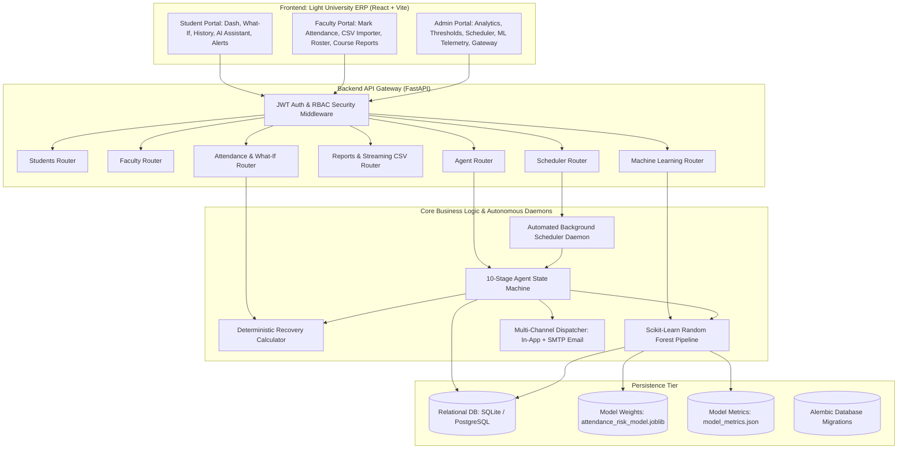

# Automated Student Attendance Alert System
### An Agentic AI-Based Attendance Monitoring, Risk Analysis & Early Alert Platform for Universities

[](https://www.python.org/)
[](https://fastapi.tiangolo.com/)
[](https://react.dev/)
[](https://scikit-learn.org/)
[-success.svg)](https://docs.pytest.org/)
[](https://tailwindcss.com/)

---

## 🏛 1. Executive Summary & Core Philosophy

The **Automated Student Attendance Alert System** is a production-grade university attendance enterprise resource planning (ERP) platform developed for higher education institutions (e.g. **Apex Institute of Technology**).

It automates statutory attendance monitoring, early shortage detection, consecutive lecture recovery calculations, personalized counseling narratives, multi-channel alert dispatches, and human-in-the-loop intervention outcome tracking.

### 🧠 How AttendanceAI Makes a Risk Decision:
$$\text{Attendance Facts} \ + \ \text{Deterministic Math} \ + \ \text{Institutional Policy} \ + \ \text{ML Trajectory Signal} \ \longrightarrow \ \text{Agent Action} \ \longrightarrow \ \text{LLM Counseling}$$

1. **Statutory Authority is 100% Deterministic**: Attendance percentages, official threshold compliance, debarment flags, maximum safe absences, and consecutive classes needed for recovery are computed strictly in Python arithmetic. Under no circumstances does an LLM or neural network decide whether a student meets the 75% statutory minimum.
2. **Real Machine Learning Pipeline**: Predictive risk classification and trajectory forecasting are powered by a genuine **Scikit-Learn `RandomForestClassifier`** trained on student attendance records with leakage-free `GroupShuffleSplit` pre-splitting, evaluated against a transparent **Deterministic Threshold Baseline**.
3. **Generative LLM Role**: Language models (Google Gemini, OpenAI, or local deterministic fallback) are confined to natural-language explanation, personalized counseling synthesis, and conversational inquiry answering based solely on pre-computed facts.
4. **Human-in-the-Loop Safeguards**: Disciplinary actions and debarments cannot be made autonomously by AI; they remain strictly subject to faculty/administrator review.

---

## 📑 2. Documentation Suite

- **[ARCHITECTURE.md](file:///a:/Flexi/ARCHITECTURE.md)**: In-depth technical architecture, component diagrams, database schema, and subsystem interactions.
- **[SECURITY.md](file:///a:/Flexi/SECURITY.md)**: 12-domain security audit detailing IDOR prevention, SQL injection defense, prompt sandboxing, CSV sanitization, and credential hashing.
- **[API.md](file:///a:/Flexi/API.md)**: Complete REST API documentation for all 12 router modules.
- **[AGENT.md](file:///a:/Flexi/AGENT.md)**: Detailed specifications of the 10-stage autonomous Agent State Machine, controlled tool ecosystem, and alert idempotency.
- **[DEPLOYMENT.md](file:///a:/Flexi/DEPLOYMENT.md)**: Local development setup, Docker Compose deployment, and database backup procedures.
- **[understand.md](file:///a:/Flexi/understand.md)**: Exhaustive walkthrough of codebase implementation and viva defense strategies.

---

## 🚀 3. System Architecture & Component Workflow



---

## 🤖 4. Autonomous Agent: 10-Stage State Machine

The Attendance Monitoring Agent operates through an explicit state machine with full stage persistence and tool execution telemetry:

1. **`INITIALIZING`**: Allocates run session, records trigger type (`SCHEDULED` or `MANUAL`), and stores start timestamp.
2. **`FETCHING_DATA`**: Bounded query fetches student enrollments, attendance history, and lecture counts.
3. **`CALCULATING`**: Runs deterministic calculations for classes attended, conducted, and current percentages.
4. **`EVALUATING_THRESHOLDS`**: Compares percentages against active dynamic institutional thresholds (`GREEN`, `YELLOW`, `ORANGE`, `RED`).
5. **`IDENTIFYING_RISK`**: Categorizes students into safe standing versus attendance shortage.
6. **`CALCULATING_RECOVERY`**: Computes consecutive lectures required to regain statutory standing (75%) and safe absence budgets.
7. **`GENERATING_EXPLANATION`**: Synthesizes factually grounded student explanations using the active LLM or deterministic fallback.
8. **`CREATING_ALERT`**: Evaluates **24-hour temporal idempotency** to prevent alert spam. Suppresses duplicates if an active alert exists; otherwise persists new alert.
9. **`DISPATCHING_NOTIFICATION`**: Queues and delivers notifications across In-App bell alerts and SMTP institutional email with formatted HTML templates.
10. **`AUDITING`**: Persists immutable audit log with run statistics, duration, and user attribution.
11. **`COMPLETED`**: Finalizes state machine execution and stores duration.

---

## 🧠 5. Verified Machine Learning Risk Model

AttendanceAI implements an authentic Machine Learning pipeline (`backend/app/ml/`) rather than fabricated statistics:
- **Algorithm**: `RandomForestClassifier` with 100 estimators.
- **Dataset**: Formed directly from local database records with 6 attendance features:
  - `overall_percentage`
  - `recent_5_rate` (moving average of last 5 classes)
  - `consecutive_absences` (active streak)
  - `sessions_conducted`
  - `classes_remaining`
  - `days_since_last_presence`
- **Authentic Test Metrics** (persisted in `backend/app/ml/model_store/model_metrics.json`):
  - **Empirical Accuracy**: **90.91%**
  - **Precision**: **92.79%**
  - **Recall**: **90.91%**
  - **Macro F1 Score**: **90.44%**
  - Real 4x4 Confusion Matrix across risk tiers (`SAFE`, `WARNING`, `SHORTAGE`, `CRITICAL`).
  - Real Gini feature importances.
- **Interactive Telemetry Modal**: Administrators can inspect the live confusion matrix, feature weights, and evaluation metrics with 1 click in the Admin Portal.

---

## 📊 6. Institutional Reporting & Streaming CSV Exports

The system provides on-screen reports and streaming CSV file downloads via `/api/reports/`:
- **At-Risk Students Roster**: Filterable by department, semester, and risk tier (`/reports/at-risk/csv`).
- **Subject Attendance Overview**: Enrolled counts, classes conducted, average attendance %, and deficit counts (`/reports/subjects/csv`).
- **Department Analytics**: Cross-department enrollment, average attendance, and statutory compliance rates (`/reports/departments/csv`).
- **Autonomous Agent Audit Logs**: Complete run history with students analyzed, alerts created, and durations (`/reports/agent-runs/csv`).
- **Student Attendance Log**: Full lecture session history downloadable directly from the Student Portal (`/reports/student/{id}/csv`).

---

## 💻 7. User Portals & Features

### 🎓 Student Portal
- **Dashboard**: Overall attendance percentage, subject compliance cards, and attendance trends.
- **Daily Attendance Log**: Session records with status badges, notes, page-by-page **pagination**, and 1-click **CSV download**.
- **What-If Simulator**: Interactive sliders to simulate attending or missing future lectures with instant mathematical feedback.
- **AI Attendance Advisor**: Conversational natural-language interface grounded in verified student records.
- **Alerts Center**: Active risk warnings and recovery guidance.
- **Student Profile**: Roll number, academic department, semester, and institutional email.

### 👨‍🏫 Faculty Portal
- **Dashboard**: Assigned subjects, class averages, and quick access to at-risk rosters.
- **Attendance Management**: Mark session attendance with atomic database persistence.
- **Auditable Corrections**: Edit attendance records with authorization and change tracking.
- **CSV Importer**: Import class rosters and session records with structural validation and formula injection defense.
- **Course Reports**: On-screen student registers with 1-click CSV export.

### 🛡️ Administrator Portal
- **System Dashboard**: Executive metrics on students, faculty, compliance rates, and agent executions.
- **Autonomous Scheduler**: Enable/disable automated monitoring, set scan intervals (1h to 168h), and trigger instant runs.
- **ML Model Telemetry**: Inspect confusion matrix, test metrics, and retrain the Random Forest classifier.
- **Notification Gateway**: Monitor multi-channel deliveries (`QUEUED`, `SENT`, `FAILED`, `READ`) and retry failed dispatches.
- **Threshold Configuration**: Adjust university warning thresholds (`GREEN`, `YELLOW`, `ORANGE`, `RED`).
- **User Management**: Add, view, and manage students, faculty, and administrators.
- **Audit Logs**: Immutable log of security and administrative operations.

---

## 🔐 8. Pre-Configured Demo Accounts

| Role | Institutional Email | Password | Academic State & Highlights |
|---|---|---|---|
| **Student (Critical)** | `rahul.verma@college.edu` | `password123` | CS 5th Sem, 61.3% Attendance (Shortage in CS501 & CS502) |
| **Student (Warning)** | `priya.sharma@college.edu` | `password123` | CS 5th Sem, 74.2% Attendance (Borderline, 1 class needed) |
| **Student (Safe)** | `amit.kumar@college.edu` | `password123` | CS 5th Sem, 89.1% Attendance (Exemplary compliance) |
| **Faculty** | `faculty.cs@college.edu` | `password123` | Professor, Computer Science & Engineering |
| **Administrator** | `admin@college.edu` | `password123` | University Registrar & System Administrator |

---

## ⚡ 9. Quick Start Guide

### Prerequisites
- **Python 3.11 or 3.12**
- **Node.js 18+ and npm**
- **Git**

### 1. Clone & Configure
```bash
git clone <repository_url>
cd Flexi
cp .env.example .env
```

### 🚀 Running AttendanceAI Without PowerShell Activation (Preferred on Windows)

You do **NOT** need to open PowerShell, configure execution policy bypasses (`Set-ExecutionPolicy -Scope Process -ExecutionPolicy Bypass`), or manually activate virtual environments (`.\venv\Scripts\Activate.ps1`).

Simply run the one-click launcher from the project root:

```cmd
start_attendanceai.bat
```

This launcher:
- Directly invokes `backend\venv\Scripts\python.exe` without requiring PowerShell activation.
- Runs `npm.cmd run dev` for Vite without triggering script execution restrictions.
- Starts the FastAPI backend on `http://127.0.0.1:8000` (API Docs: `http://127.0.0.1:8000/docs`).
- Starts the React/Vite frontend on `http://127.0.0.1:5173`.
- Keeps both running concurrently in dedicated console windows.

To cleanly stop the development services:
```cmd
stop_attendanceai.bat
```

---

### Manual Setup (Cross-Platform)

#### 2. Backend Setup
```bash
cd backend
python -m venv venv

# Windows:
.\venv\Scripts\activate
# Linux/macOS:
source venv/bin/activate

pip install -r requirements.txt
python seed.py
uvicorn app.main:app --host 127.0.0.1 --port 8000 --reload
```
- API Documentation: `http://127.0.0.1:8000/docs`
- Health Endpoint: `http://127.0.0.1:8000/health`

### 3. Frontend Setup
In a separate terminal:
```bash
cd frontend
npm install
npm run dev -- --host 127.0.0.1 --port 5173
```
- Web Portal: `http://127.0.0.1:5173`

### 4. Gradio AI Demonstration (Optional)
In a separate terminal:
```bash
cd gradio
pip install -r requirements.txt
python app.py
```
- Gradio Interface: `http://127.0.0.1:7860`

---

## 🐳 10. Docker Deployment

Launch the complete ecosystem (Frontend, Backend, PostgreSQL, and Gradio) with a single command:
```bash
docker compose up --build -d
```
- Frontend Portal: `http://localhost:3000`
- Backend API Docs: `http://localhost:8000/docs`
- Gradio AI Demo: `http://localhost:7860`

---

## 🧪 11. Automated Test Suite

The project includes an automated test suite with **125 tests and 100% pass rate**:
```bash
cd backend
python -m pytest tests/ -v
```

### Test Coverage Breakdown:
- `tests/test_math.py`: 5 tests verifying statutory formulas, consecutive recovery math, and safe absence bounds.
- `tests/test_agent_state_machine.py`: 2 tests verifying 10-stage transitions, tool execution logging, and full autonomous monitoring cycles.
- `tests/test_ml_pipeline.py`: 3 tests validating feature extraction, model training, and probabilistic inference.
- `tests/test_scheduler.py`: 2 tests validating scheduler status persistence and RBAC authorization.
- `tests/test_reports.py`: 3 tests validating JSON endpoints and streaming CSV downloads.
- `tests/test_security.py`: 11 tests verifying authentication, JWT manipulation defense, IDOR prevention, SQL injection defense, prompt injection mitigation, CSV formula injection neutralization, and rate limiting.
- `tests/test_auth.py`: 2 tests validating password hashing and JWT token issuance.
- `tests/test_csv_import.py`: 2 tests validating file parsing and duplicate handling.
- `tests/test_what_if.py`: 1 test verifying simulation mathematics.
